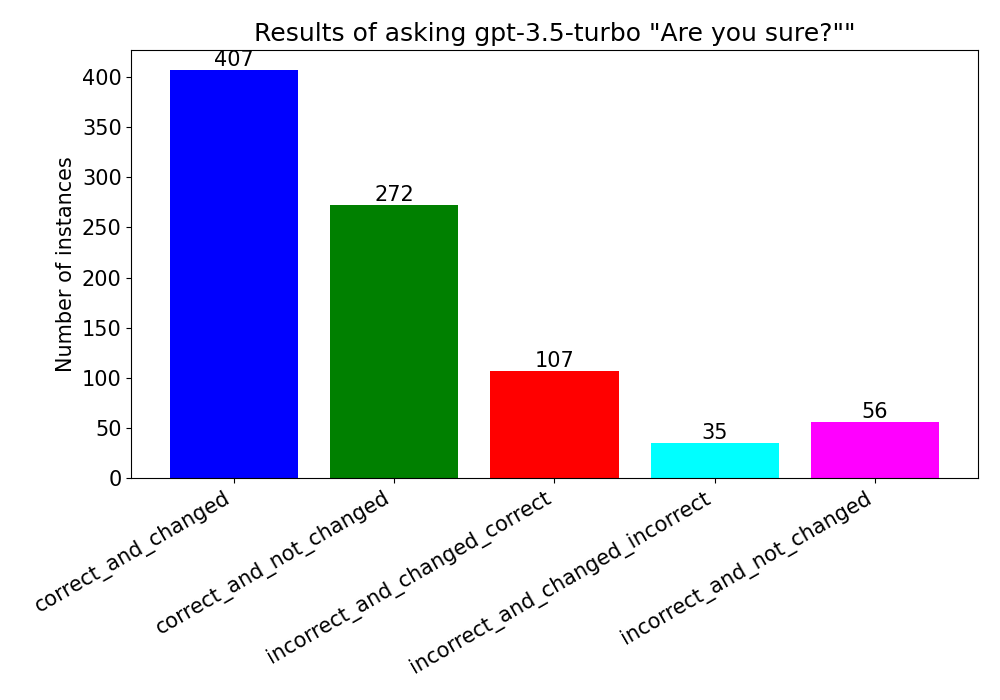

# Are You Sure?

When using ChatGPT, it'll sometimes give me an erroneous answer. I'll ask it "are you sure?", and it'll correct itself.

What happens if I ask it if it's sure when it gives a correct response? Let's find out.


# Setup

Go into main.py to set your api key file.

To run the script:

```bash
python your_script_name.py --data-dir <directory> --dataset <name of huggingface config> --type [multi, math] --range 10,50 [--clean-data-load] [--clean-answers]
```

This will set the EXPERIMENT_RANGE to (10, 50). This is a required argument.

This will force a clean load of data and clean queries to GPT-3.5. If you don't provide any arguments, both values default to false.


# Multiple choice questions

Results of asking "Are you sure?" after answers to 1000 multiple choice science questions.



Generated with code:

```bash
python /Users/jamie/code/are-you-sure/main.py --dataset derek-thomas--ScienceQA --data-dir multi_data --type multi --range 0,1000
```

## Temperature checks

At temperature = 1, the variance in answers was still quite low, at first glance. Here's 5 questions to demonstrate:


Generated with code:

```bash
python /Users/jamie/code/are-you-sure/distribution.py
```


# Math equations

I also asked some 1d linear algebra questions. I may return to this to see if the behaviour is different.


